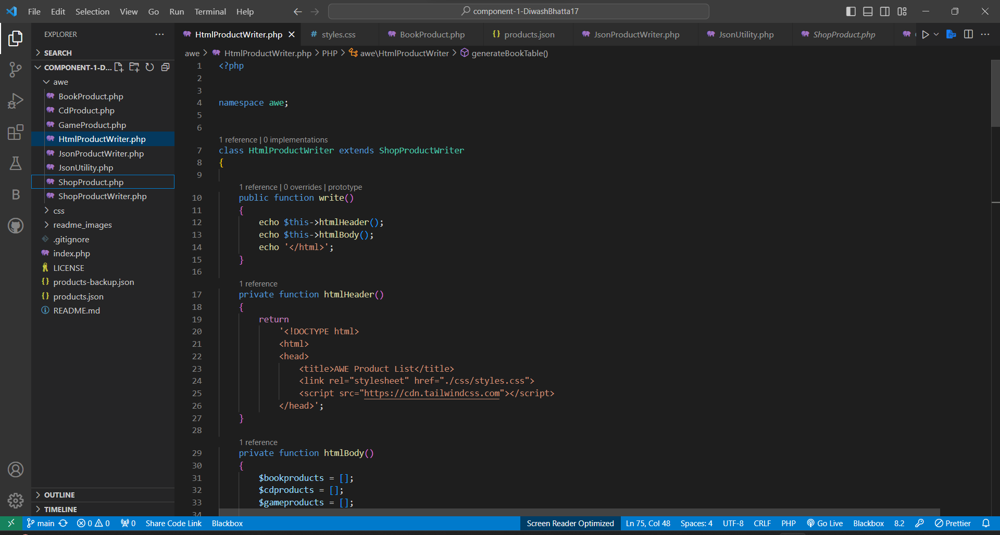
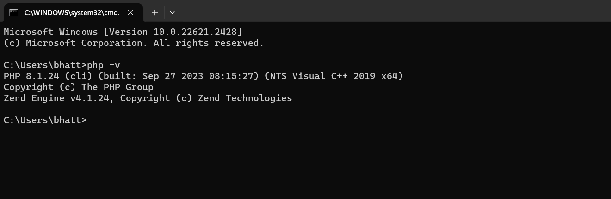
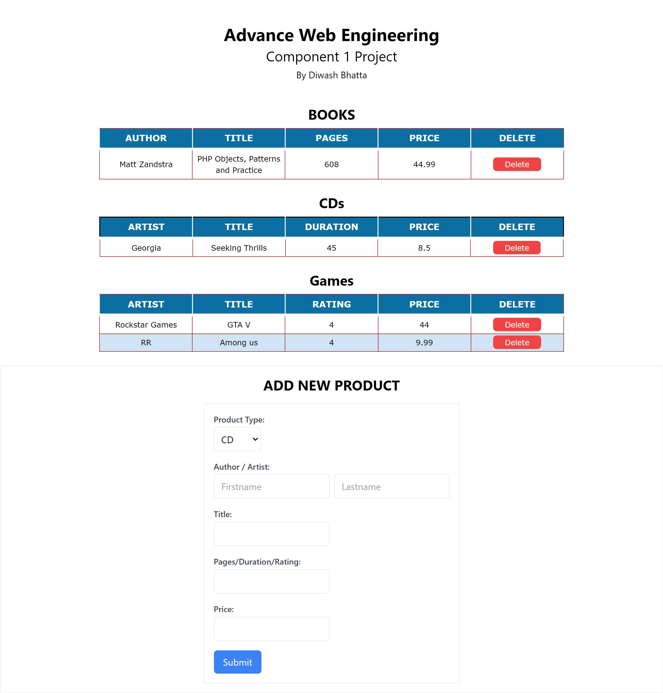
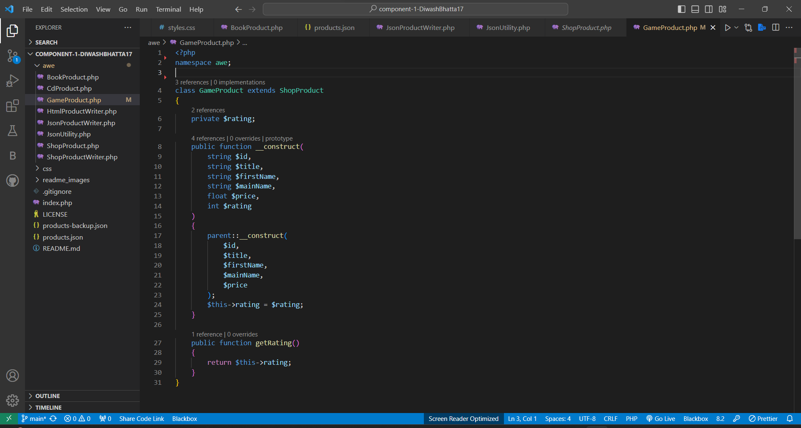
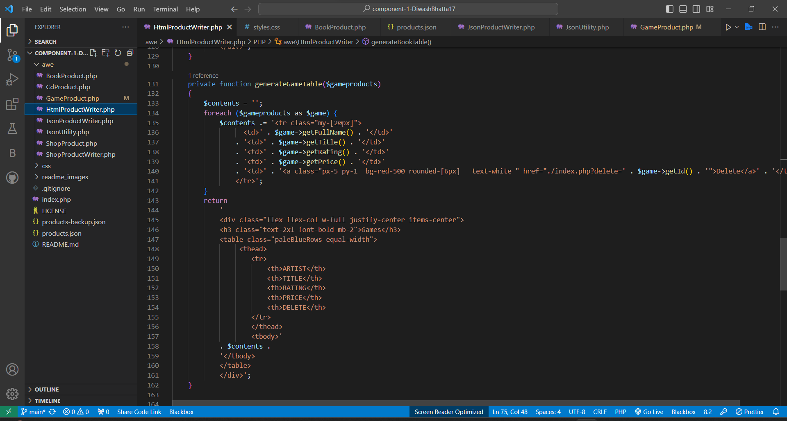
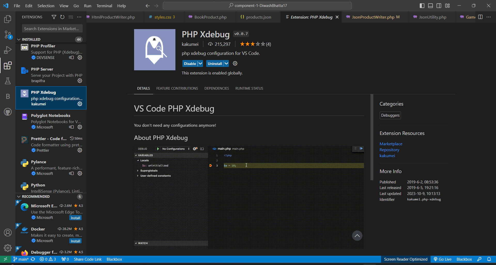

# Advance Web Engineering - Component 1 BY Diwash Bhatta

This repository contains the development work for Component 1 by Diwash Bhatta.
                Student Id- 77297903
                

## Development Choice

- Visual Studio Code

## PHP Version Used

- 8.1.24

## GitHub Repository Link

- [GitHub Repository](https://github.com/tbc-bsc-l6/component-1-DiwashBhatta17.git)

## PHP Exercise Component 1 Completed

- Yes
, I have completed the PHP exercise for Component 1.

## PHP Xdebug Install Screenshot

